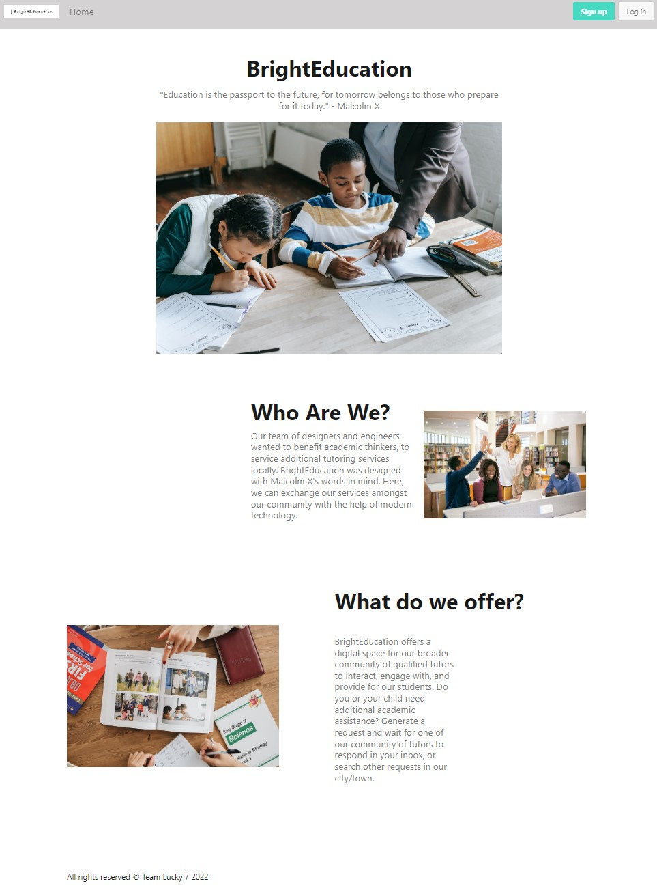

# BrightEducation 
  
  # Table of Content
  - [Description](#Description)
  - [Installation](#Installation)
  - [Usage](#Usage)
  - [License](#License)
  - [Contribution](#Contribution)
  - [Tests](#Tests)
  - [Preview](#Preview)
  - [Accreditations](#Accreditations)

   
## Description:
Welcome to the future of education! With BrightEducation, you can enroll your child into any class where they may need to brush up on some skills or want to be challenged at a higher level. With our professionally certified teaching staff, we guarantee to enrich your child's education no matter the cause. Sign up today to view the available courses we have to offer and match with a tutor!
    
## Installation:
You can find our app available online and ready to use. Just click [here](https://brighteducation.herokuapp.com/) and create your account today!
    
## Usage:
Visit our app at https://brighteducation.herokuapp.com and you should be presented with the main page. If you head towards the upper right corner you are given the option to sign up or log in. If you click on sign up you will be directed to a sign up page in which you will provide user credentials. Once you are logged in, the navigation bar will show available classes to enroll in.

## License:
Copyright 2022, Team 7

Permission is hereby granted, free of charge, to any person obtaining a copy of this software and associated documentation files (the "Software"), to deal in the Software without restriction, including without limitation the rights to use, copy, modify, merge, publish, distribute, sublicense, and/or sell copies of the Software, and to permit persons to whom the Software is furnished to do so, subject to the following conditions:

The above copyright notice and this permission notice shall be included in all copies or substantial portions of the Software.

THE SOFTWARE IS PROVIDED "AS IS", WITHOUT WARRANTY OF ANY KIND, EXPRESS OR IMPLIED, INCLUDING BUT NOT LIMITED TO THE WARRANTIES OF MERCHANTABILITY, FITNESS FOR A PARTICULAR PURPOSE AND NONINFRINGEMENT. IN NO EVENT SHALL THE AUTHORS OR COPYRIGHT HOLDERS BE LIABLE FOR ANY CLAIM, DAMAGES OR OTHER LIABILITY, WHETHER IN AN ACTION OF CONTRACT, TORT OR OTHERWISE, ARISING FROM, OUT OF OR IN CONNECTION WITH THE SOFTWARE OR THE USE OR OTHER DEALINGS IN THE SOFTWARE.

[License](https://www.mit.edu/~amini/LICENSE.md) 
    
## Contribution:
Bryan Sayavong, Cosmin Sandu, Joon Lee, Sheetal Jawale, & Stephen Novelli
    
## Test:
No tests are required.
    
## Preview:

## Accreditations:
  BrightEducation was styled using the Bulma Framework and utilizes Handlebars.js as the primary templating language. MySQL is used as our database management system, while Express.js builds our RESTful API with the Node.js framework. BrightEducation is deployed for use publicly via Heroku.